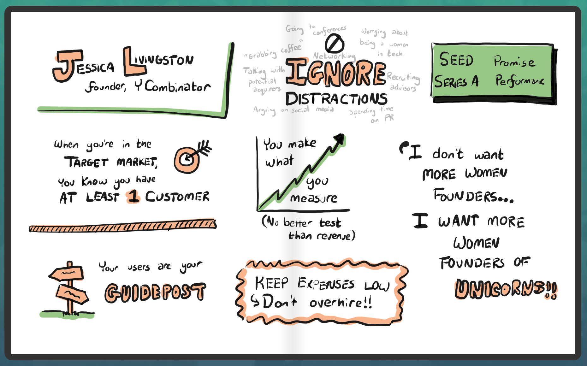

# Jessica Livingston's Pretty Complete List on How Not to Fail
by Jessica Livingston

- [Essay](http://www.themacro.com/articles/2016/06/how-not-to-fail/)
- [Video](https://www.youtube.com/watch?v=a2B4cVFIVpg)
- [HN comments](https://news.ycombinator.com/item?id=11870062)

The most common mistakes founders make and how to avoid them.

---

## Intro
## 1. Make something people want.
## 2. Stay focused.
## 3. Don't worry about being a woman.
## 4. Measure your growth.
## 5. Know if you're default alive.
## 6. Keep expenses low.
## 7. Fundraising gets harder.
## Unicorns / Conclusion
